# Into the Job Market: Gender Fairness in Recruitment Dataset

## Contributors 
Alkmini Sapountzaki (alks@itu.dk), Caroline Sofie Skovby (cssk@itu.dk), Miriam Espinosa Solana
(miri@itu.dk)

## Data 

The analysis is based on the Utrecht Fairness Recruitment dataset [12]. This dataset consists of 4.000 job applicants. In addition to the recruitment label, the dataset contains 13 attributes that describe the applicant and their CV.
Most attributes are categorical, such as gender, nationality, highest level of completed degree, and main sport listed on the CV. The numerical attributes include age, university grade (percentage), and number of additional languages spoken by the applicant. An overview of the attributes and their distribution can be found in Appendix I.

The dataset's documentation does not specify what exact job the applicants are applying for or whether they are applying for the same position, but based on the inclusion of attributes such as if an applicant has studied a science related topic and whether they have experience in programming, entrepreneurship, or working internationally, we will assume that the recruitment are supposed to be for high-paid white-collar jobs.

Figure 1 provides an initial overview of the relationship between gender and the recruitment outcome. The dataset contains 54.3\% male applicants and 45.7\% female applicants (see Appendix I). The selection rates suggest a gender imbalance: 35.3\% of male applicants receive a positive recruitment outcome, compared with 27.5\% of female applicants.

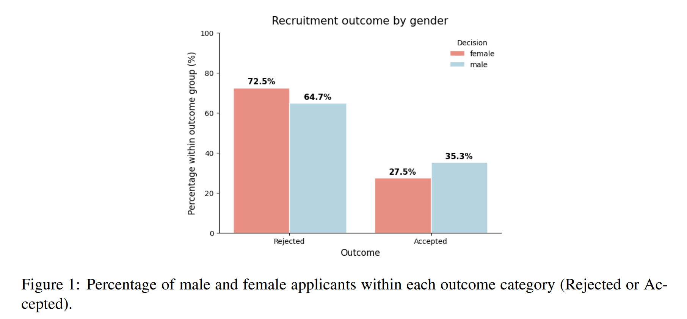

Figure 2 presents the statistically significant correlations between the one-hot encoded applicant attributes and the recruitment outcome. The strongest positive associations are observed for the number of spoken languages, having a master's degree, debate club participation, entrepreneurship experience, and university grade. Conversely, having as highest education a bachelor degree, being female and applying to company C are negatively associated with the recruitment outcome.

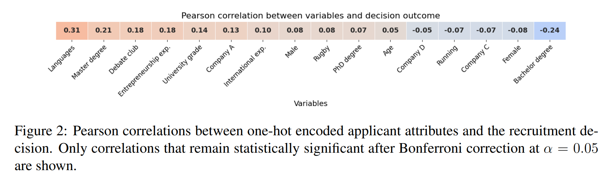

After observing a correlation between the recruitment outcome and gender, we further examined the relationship between gender and the remaining applicant attributes. The purpose of this analysis was to investigate whether other variables in the dataset may act as proxies for gender, and therefore preserve gender-related information even when the protected attribute is removed from the model. The results are shown in Figure 3. Several variables that were positively correlated with the recruitment outcome are also positively correlated with being male, including the number of spoken languages, entrepreneurship experience, and debate club participation. This suggests that removing gender from the model may not fully eliminate gender-related information, since some applicant attributes are themselves associated with gender.

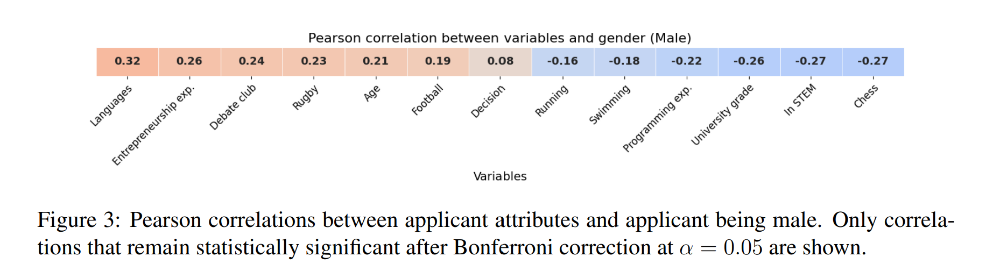

## Results 
### Baseline Model: Logistic Regression with Cross-Validation
The initial model that was a logistic regression classifier using 5-fold cross validation. The model achieved an overall test accuracy of 73\% and weighted average F1-score of 72\%, which represents a reasonable performance for a baseline classifier. However, there is a significant discrepancy between the performance on the Hired and Not-Hired classes. The classification report is shown in Table 2. 

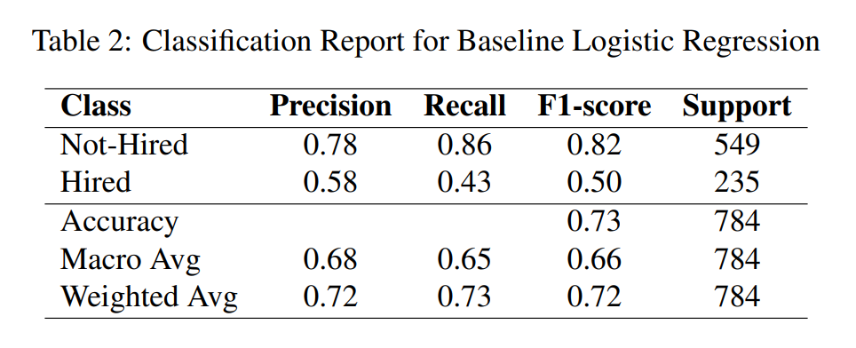

Fairness analysis was conducted using statistical parity, which compares the positive rates across demographic groups. The proportion of positive predictions for females was 12.8\%, while the proportion of males was 30\%, as shown in Figure 4. This resulted in a statistical parity ratio of approximately 0.42, indicating that females received positive predictions at less than half the rate of males.

It is important to note that the original recruitment dataset already had a gender imbalance, as shown in Figure 1. Although the dataset itself was biased, the baseline logistic regression model amplified this disparity further.

In the next experiment, gender was removed from the feature set in an attempt to reduce potential gender bias in the model predictions. However, the overall performance remained nearly unchanged, as shown in Table 3. 

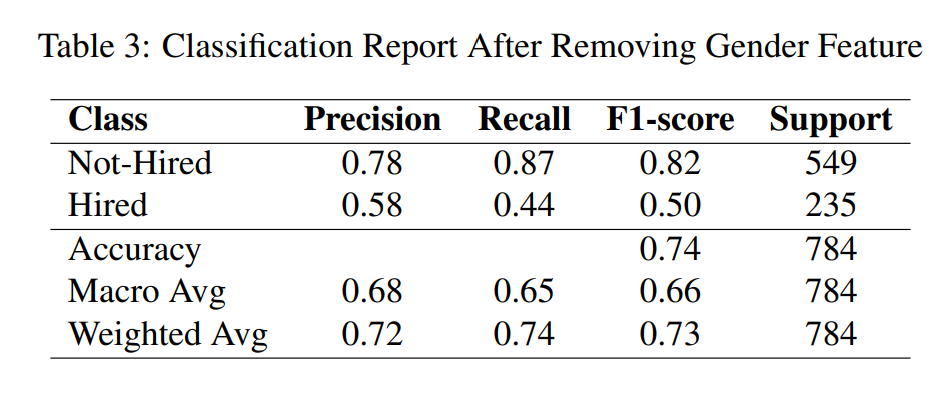

Regarding fairness metrics, the proportion of women selected was increased slightly from 12.8\% to 14.3\%, while the proportion for men decreased from 30.2\% to 29.3\%, as shown in Figure 4. As a result, the statistical parity ratio improved from 0.42 to 0.49 after removing the gender attribute. These findings suggest that removing only the protected feature gender is inefficient to eliminate bias. This is likely because other features in the dataset are highly correlated with gender, as shown in Figure 3.

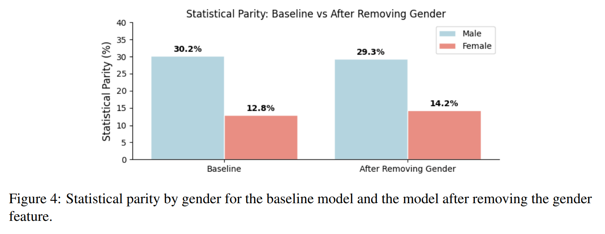

###  Proposed Method: Gender-Blind Logistic Regression with Fair PCA

Pearson's correlation coefficient between gender and other features was calculated, as shown in Figure 5a. Gender was found to be strongly correlated with several features, including grade and participation in debate club. Therefore, simply removing the gender feature was not enough to mitigate potential biases. After applying fair PCA (Figure 5b), all correlations between gender and the other features were removed, showing that the debiased dataset is not significantly influenced by gender.

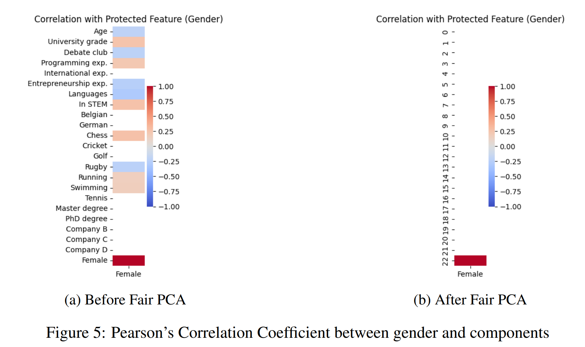

As shown in Table 4, the performance metrics changed only slightly after applying fair PCA. However, as illustrated in Figure 6, the fairness metric, statistical parity, improved substantially. In the baseline model, 30\% of men were selected, compared to 22.5\% after applying fair PCA. Similarly, the selection rate for women increased from 12.7\% to 16.5\%. As a result, the statistical parity ratio improved from 0.42 to 0.73.

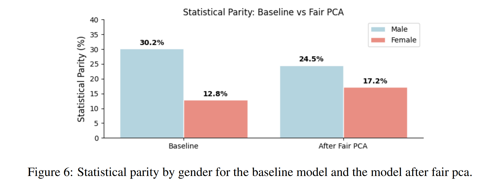

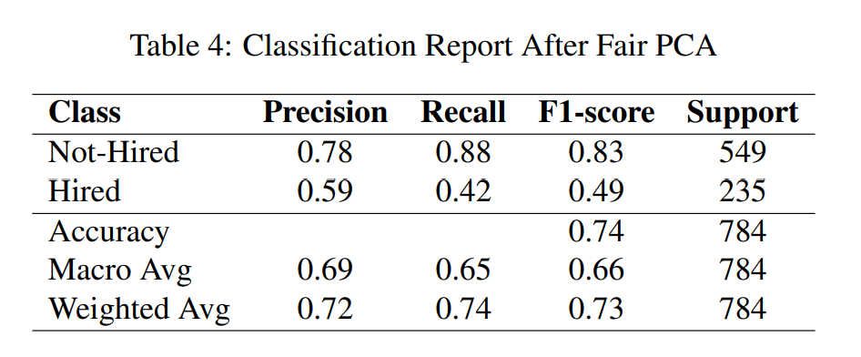

### Evaluation of Fair PCA 
A drawback of using principal components is that they make the interpretation of a model's feature importance less transparent. In this case, we are only interested in knowing whether gender has any impact on any of the new features, since the fair PCA should not contain any information on protected attributes. 

To test this out, we took a random sample from the test set and flipped the applicant's gender before projecting the features onto the debiased space and making a prediction. 

We then made a plot of the SHAP values of this applicant where their gender had been flipped, (Figure 7) and another SHAP plot with their true gender (Figure 8). We can see that while the model's classification stayed the same, the values of the new features did change and so did the order of importance for some of them. This means that there is still some information on gender present in the debiased dataset.

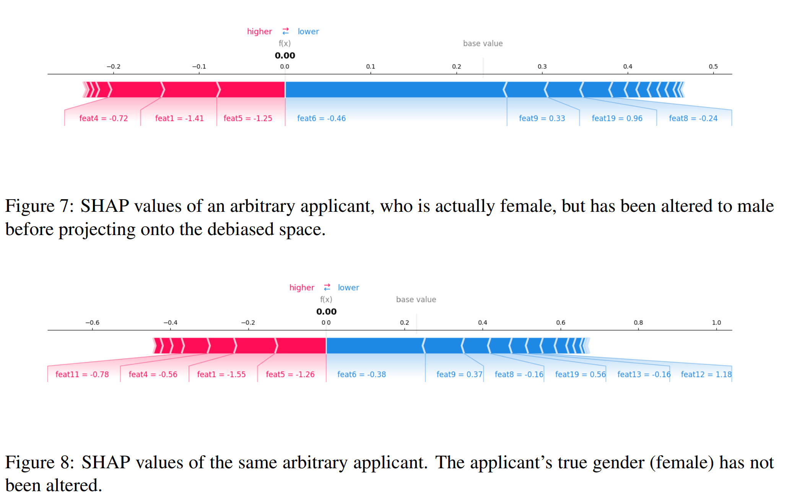

To further investigate gender's influence on a bigger scale, we ran the fair PCA model on a copy of the full test data that had all the genders flipped and compared the evaluation metrics.
Figure 9 shows that the proportion of actual males, who the fair PCA has been told are females, has increased from 0.25 to 0.34 and the proportion of actual females, who the PCA model has been told are males, has decreased from 0.17 to 0.11. This effect is seen in both the true positive rates and the false positive rates. This means that the information on gender that is still present after using fair PCA is enough to change the classification of a person in some cases. Both groups have a higher selection rate when they are coded as female in the data. This implies that the fair PCA model has some bias that favors women over men.

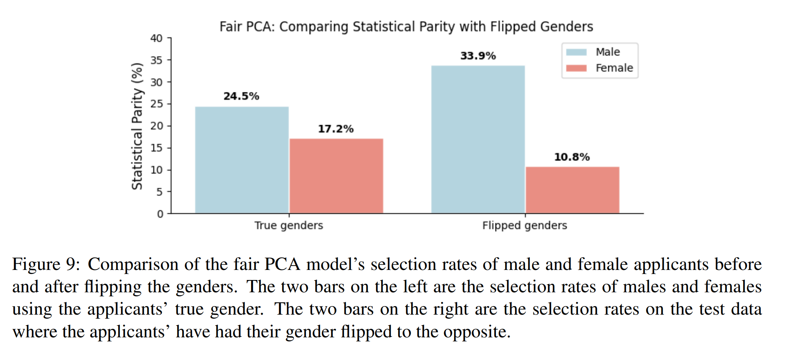

## Discussion 
We decided to remove the entries with "other" as gender attribute,
for simplicity. However, we acknowledge that this does not reflect the real world.

A fairness intervention, like fair PCA, is justified only if it improves the position of disadvantaged groups without creating a new unfair system. Since the fair PCA model still contains some gender-related influence and even appears to favor women in some cases, it would need continuous auditing after deployment.

If, in the future, gender representation in recruitment data becomes more balanced, continuing to use the same fair PCA transformation could create a new imbalance in the opposite direction. In our results, the fair PCA model still retained some gender-related information that appeared to favour women in some cases. Therefore, a debiasing method that is useful in the current context may not remain fair under different social conditions. For this reason, the model would need to be regularly retrained and audited using new data. Ideally, these new data points would come from a less biased recruitment context, where gender is no longer strongly associated with hiring outcomes or job-related attributes. Only then it would be more realistic to train a classifier that bases its predictions primarily on merit and qualifications, rather than on patterns inherited from historical discrimination.

Based on our evaluation, the fair PCA did not completely achieve our goal of making a debiased dataset that does not contain any information of gender in its attributes. An alternative method of decorrelating protected attributes with unprotected ones is the geometric solution for fair representations [15].
However, this approach is less suitable for our dataset because many of the applicant attributes are binary or categorical and are represented through one-hot encoding. Combined with the previously mentioned biases of the labels, this leads us to conclude that it is not possible to fully debias this particular dataset.

## References
[1] Rohit Bansal Himanshu Rai, Arti Gupta. Impact of Artificial Intelligence on Data-Driven Decision Making in HR for Revolutionizing Organizational Growth. Emerald Publishing Limited, 2025. ISBN 978-1-
83662-983-2.

[2] Sri Sundari, VAJM Silalahi, FP Wardani, RS Siahaan, Shinta Sacha, Yanti Krismayanti, and Nisa Anjarsari. Artificial intelligence (ai) and automation in human resources: Shifting the focus from routine
tasks to strategic initiatives for improved employee engagement. East Asian Journal of Multidisciplinary
Research, 3(10):4983–4996, 2024.

[3] Gangesh Pathak and Divya Pandey. Ai agents in recruitment: A multi-agent system for interview, evaluation, and candidate scoring. Evaluation, and Candidate Scoring (May 01, 2025), 2025.

[4] Md Sajjad Hosain, Mohammad Bin Amin, Gouranga Chandra Debnath, and Md Atikur Rahaman. The
use of artificial intelligence (ai) in the hiring process: Job applicants’ perceptions of procedural justice.
Computers in Human Behavior Reports, 19:100713, 2025.

[5] Eleanor Drage and Kerry Mackereth. Does ai debias recruitment? race, gender, and ai’s “eradication of
difference”. Philosophy & technology, 35(4):89, 2022.

[6] Anna Lena Hunkenschroer and Christoph Luetge. Ethics of ai-enabled recruiting and selection: A review
and research agenda. Journal of business ethics, 178(4):977–1007, 2022.

[7] Zhisheng Chen. Ethics and discrimination in artificial intelligence-enabled recruitment practices. Humanities and social sciences communications, 10(1):567, 2023.

[8] European Parliament and Council of the European Union. Regulation (EU) 2024/1689 of the European
Parliament and of the Council of 13 June 2024 laying down harmonised rules on artificial intelligence
and amending Regulations and Directives. Official Journal of the European Union, 2024. URL https:
//eur-lex.europa.eu/eli/reg/2024/1689/oj. Recital 57.

[9] James Vincent. Amazon reportedly scraps internal ai recruiting tool that was biased
against women, 2018. URL https://www.theverge.com/2018/10/10/17958784/
ai-recruiting-tool-bias-amazon-report.

[10] Giandomenico Cornacchia, Vito Walter Anelli, Giovanni Maria Biancofiore, Fedelucio Narducci, Claudio
Pomo, Azzurra Ragone, and Eugenio Di Sciascio. Auditing fairness under unawareness through counterfactual reasoning. Information Processing & Management, 60(2):103224, 2023.

[11] Matthäus Kleindessner, Michele Donini, Chris Russell, and Muhammad Bilal Zafar. Efficient fair pca for
fair representation learning, 2023. URL https://arxiv.org/abs/2302.13319.

[12] ICT Institute. Utrecht fairness recruitment dataset. Kaggle, 2025. URL https://www.kaggle.
com/datasets/ictinstitute/utrecht-fairness-recruitment-dataset. Accessed:
2026-05-14.

[13] World Economic Forum. Global gender gap report 2025: Digest. https://www.weforum.org/
publications/global-gender-gap-report-2025/digest/, June 2025. Accessed: 2026-
05-14.

[14] Ninareh Mehrabi, Fred Morstatter, Nripsuta Saxena, Kristina Lerman, and Aram Galstyan. A survey on
bias and fairness in machine learning. ACM computing surveys (CSUR), 54(6):1–35, 2021.

[15] Yuzi He, Keith Burghardt, and Kristina Lerman. A geometric solution to fair representations. In Proceedings of the AAAI/ACM Conference on AI, Ethics, and Society, pages 279–285, 2020.

[16] Gordon Graham. Theories of ethics: An introduction to moral philosophy with a selection of classic
readings. Routledge, 2010.

## Appendix 
### I. Dataset Attributes

Table 1 presents the names of the variables in the dataset and their descriptions. After removing entries where
gender was recorded as other, the dataset contains 3,917 observations.

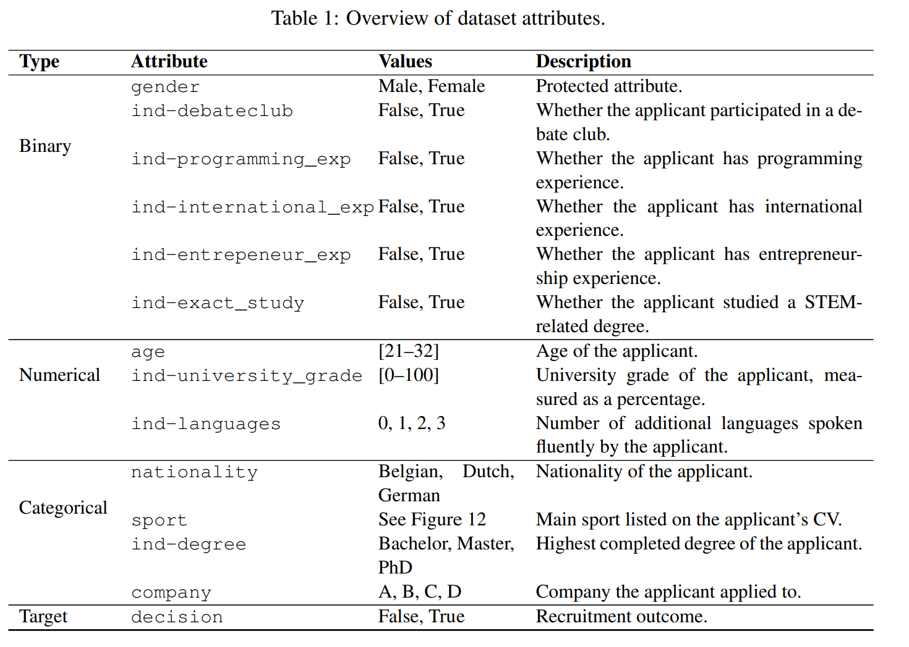

Figures 10, 11, and 12 show the distribution of the dataset attributes according to their variable type.
Figure 10 presents the binary variables, Figure 11 shows the continuous variables, and Figure 12 displays the
categorical variables.

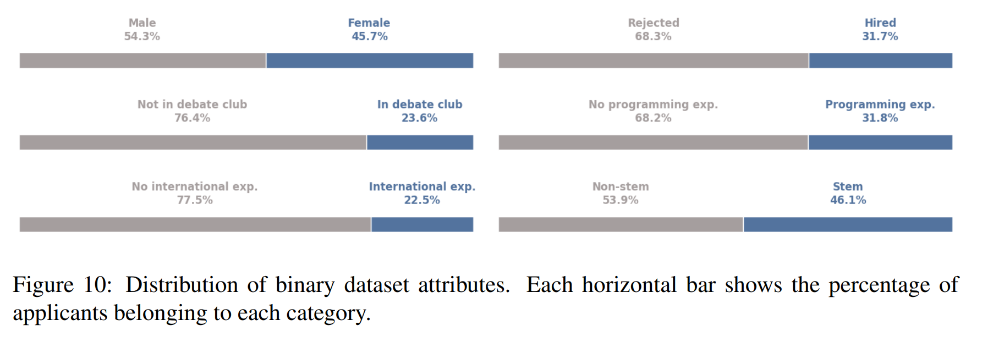

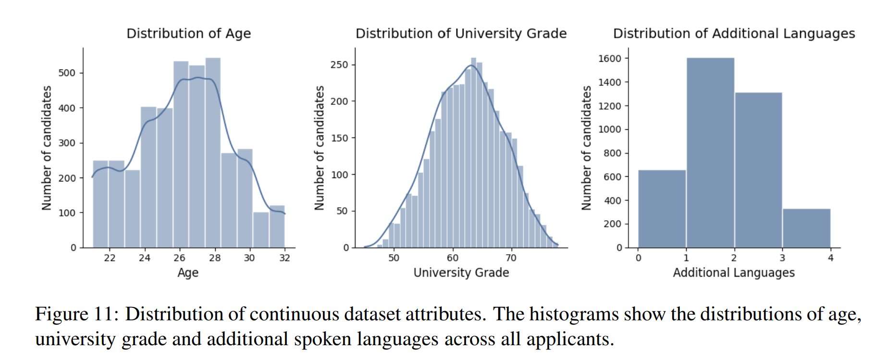

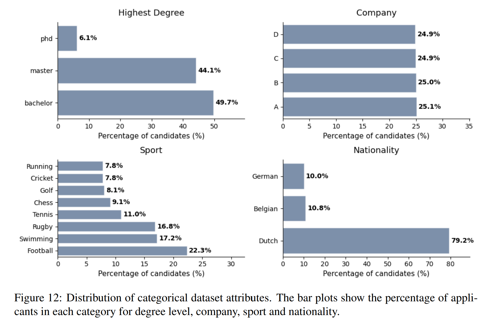